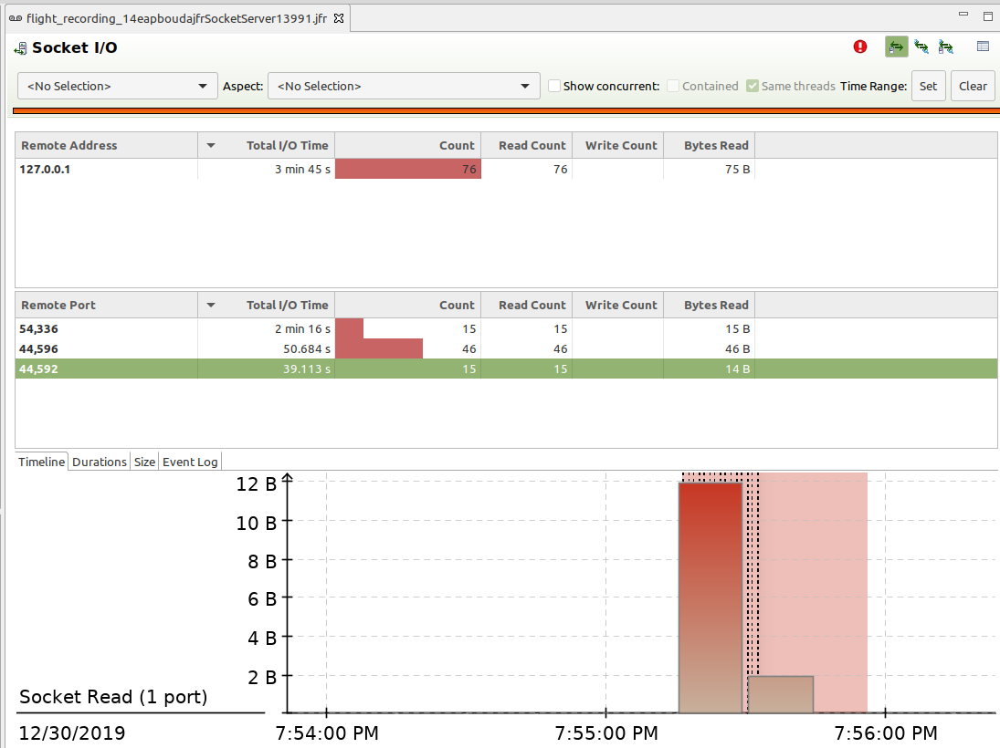

# SOCKETS

- https://docs.oracle.com/javase/8/docs/technotes/guides/troubleshoot/performissues005.html

#### SOCKET_READ

- `jdk.SocketRead`
- `#threshold: 10 ms`
- it can be very high if an application uses `Blocking I/O` because it's waiting for `read` operation
- `Non-Blocking I/O` does not impact monitoring and does not emit SocketRead events

```
jdk.SocketRead {
  startTime = 19:33:10.386
  duration = 36.5 s
  host = "localhost"
  address = "127.0.0.1"
  port = 54336
  timeout = 0 s
  bytesRead = 1 byte
  endOfStream = false
  eventThread = "Thread-2" (javaThreadId = 23)
  stackTrace = [
    java.net.Socket$SocketInputStream.read(byte[], int, int) line: 68
    java.net.Socket$SocketInputStream.read() line: 977
    java.io.DataInputStream.readUnsignedShort() line: 341
    java.io.DataInputStream.readUTF(DataInput) line: 593
    java.io.DataInputStream.readUTF() line: 568
    ...
  ]
}
```

- JVM very often emits events for RMI TCP belonging to Serviceablility Agent

```
jdk.SocketRead {
  startTime = 19:59:11.341
  duration = 382 ms
  host = "localhost"
  address = "127.0.0.1"
  port = 44604
  timeout = 2 h 0 m
  bytesRead = 1 byte
  endOfStream = false
  eventThread = "RMI TCP Connection(idle)" (javaThreadId = 30)
  stackTrace = [
    java.net.Socket$SocketInputStream.read(byte[], int, int) line: 68
    java.io.BufferedInputStream.fill() line: 244
    java.io.BufferedInputStream.read() line: 263
    java.io.FilterInputStream.read() line: 82
    sun.rmi.transport.tcp.TCPTransport.handleMessages(Connection, boolean) line: 569
    ...
  ]
}
```

- `Blocking I/O` has a problem that it reads one byte after another, therefore, there are only one-byte reads even if the message is a name
- Is it true? even if `java.net.Socket$SocketInputStream.read(byte[], int, int) line: 68`



#### SOCKET_WRITE

- `jdk.SocketRead`
- `#threshold: 10 ms`
- it's not so often to see high write duration, because data is written immediately
- we can find an issue with `TCP WRITE BUFFERS` if it's full, then `write` is blocked for a long time

```
jdk.SocketWrite {
  startTime = 19:33:10.341
  duration = 20.9 ms
  host = "localhost"
  address = "127.0.0.1"
  port = 54336
  bytesWritten = 69 bytes
  eventThread = "Thread-2" (javaThreadId = 23)
  stackTrace = [
    java.net.Socket$SocketOutputStream.write(byte[], int, int) line: 65
    java.io.DataOutputStream.write(byte[], int, int) line: 106
    java.io.DataOutputStream.writeUTF(String, DataOutput) line: 397
    java.io.DataOutputStream.writeUTF(String) line: 325
    pbouda.jfr.ClientHandler.run() line: 75
    ...
  ]
}
```


